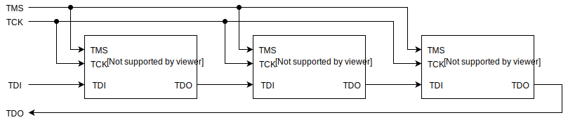

# Overview of embedded programming and debugging

Here you will get an overview of how programming, the chip that is, and debugging of embedded hardware is connected and utilized.
Further into this book we will touch on everything from simply flashing a binary onto a chip to single stepping through each instruction, inspecting memory and register, instructing the CPU where to halt execution and wait for input, look for changes in specific memory locations, etc.

## Why programmers and debuggers

### What are debuggers and programmers?

Commonly, a debugger and a programmer is the same piece of hardware, which have the specific function to act as bridges to talk from a PC to a micro controller.
In contrary to developing a program and running it on a PC, we need both to move the compiled program to the micro controller and instruct the micro controller to execute the program - this transfer of programs and tool to command the micro controllers are called *debuggers*.
While these tools are very powerful and gives the user complete access and jurisdiction over a micro controller, even to the point that the user can rewrite arbitrary memory manually if desired, they are also our main tool to understand and debug the inner workings of the system as we are used to in normal PC development.

**SHOULD WE ADD IMAGES OF COMMON HARDWARE TOGETHER WITH SOME DESCRIPTION?**

## GDB

Currently the only option for debugging embedded targets is a version of `gdb` specifically targetted to your processor architecture, for example, `arm-none-eabi-gdb` for bare metal arm targets. Unlike debugging on a local machine, the gdb instance and application code are typically run on different machines. gdb supports this through the use of servers and _remote targets_, whereby a programmer or debugger might implement the gdb server, and the gdb instance can connect to this to interact with the running applicaton.

The invocation of GDB is typically independent of the programmer and thus server you're using, though you may have to change the remote server address when connecting and some options (such as semihosting) may or may not be available when using different programmers.

### Connecting

- Run `gdb ELF` where ELF is your output file to start gdb (ie. `gdb target/thumbv7em-none-eabihf/release/hello_world`)
- Enter `target extended-remote :PORT` to connect to the gdb server (ie. `target extended-remote :4242`), note that this may be a TCP or serial port depending on the programmer
- Get debugging!

gdb will automatically execute commands from a `.gdbinit` file in the directory from which it is executed, allowing you to automate the connection to the gdb server and setting any breakpoints you might need. A useful minimal example is:
```
# Connect to the remote target
target extended-remote :4242
# Load the application
load
# Set a breakpoint on our entry to main
break main
# Start execution
continue
```

### Useful Commands

- `target extended-remote ADDR` connects to a remote target.
- `break LOCATION` or `b LOCATION` sets a breakpoint, for example `b main` sets a breakpoint on the entry to main.
- `print VARIABLE` or `p VARIABLE` prints the value of a variable at the point you are inspecting, `p\x VARIABLE` prints it in hex.
- `delete N` or `d N` deletes a breakpoint by index.
- `continue` or `c` continues to the next breakpoint.
- `step` or `s` steps through execution line by line.
- `backtrace` or `bt` prints a backtrace from the point you are currently inspecting.
- `load` flashes the current binary to the device.
- `run` re-starts an application.
- `layout LAYOUT` switches to different views, useful options are `SRC` for source, `REGS` for registers, `ASM` for assembly.
- `quit` or `q` gets you out, though you may have to interrupt with `ctrl+c` if the application is currently running.
- `source FILENAME` runs the commands specified in `FILENAME`.
- `set substitute-path SRC DST` substitutes paths that start with `SRC` with `DST`. This is useful for stepping into the rust sources as explained later.

You can invoke gdb with the source layout loaded by passing the `--tui` argument in the command line, note that `tui` mode starts with the source view selected so normal control keys will scroll the source view instead of the terminal, you can move through previous and next commands with `ctrl+P` and `ctrl+N` respectively, or use `ctrl+x o` to move focus between the source and terminal views and use your arrow keys and page-up/page-down as normal.

In general gdb will interpret the shortest series of characters required to uniquely identify a command as that command, for example `tar` instead of `target`.

When trying to step into the rust sources you may get an error that files with paths similar to `/rustc/e305df1846a6d985315917ae0c81b74af8b4e641/...` cannot be found. This is because the rust sources are compiled on a build server in the directory `/rustc/{commit_hash}`. To find this commit hash you can use the command `rustc -Vv`. The `set substitute-path` command can then be used to substitute this with your `{RUST_SRC_PATH}/lib/rustlib/src/rust` (`RUST_SRC_PATH` can be found from the output of `rustc --print=sysroot`). For example:

```set substitute-path /rustc/e305df1846a6d985315917ae0c81b74af8b4e641 "C:/Users/username/.rustup/toolchains/nightly-x86_64-pc-windows-msvc/lib/rustlib/src/rust"```

### VSCode Integration

The [Native Debug] extension can be used to debug Rust code directly in the editor. To use it you will need to add a launch configuration to your `.vscode/launch.json` file. Below is an example that connects to a Segger JLink server on port 2331. If you are using OpenOCD this port is most likely 3333.

```
"configurations": [
    {
        "name": "JLink Remote",
        "type": "gdb",
        "request": "launch",
        "cwd": "${workspaceRoot}",
        "target": "${workspaceRoot}/target/thumbv7em-none-eabihf/debug/hello", 
        "gdbpath" : "arm-none-eabi-gdb",
        "autorun": [
            "source -v debug.gdb",
        ]
    }
]
```

Make sure to change the `"target"` to match the destination of your output file.

Before launching the debugger in VSCode you must ensure that JLinkGDBServer, OpenOCD or other debugger of choice is running on the correct port. Once running you can then set breakpoints in the code margin and hover over local or global variables to see their current value


[Native Debug]: https://marketplace.visualstudio.com/items?itemName=webfreak.debug


## Cargo run integration

The `cargo run` command can be configured to start the debugger. To use this, simply add the following to the appropriate target in your `.cargo/config`:

```runner = "arm-none-eabi-gdb -q -x debug.gdb"```

## Interfaces / Protocols

When it comes to talking to micro controllers, there are two common interfaces JTAG (Joint Test Action Group) and SWD (Serial Wire Debug).

### JTAG

While [JTAG] has a long history, the main feature of JTAG, which SWD does not have, is the possibility to daisy-chain multiple micro processors, FPGAs, memory chips, simply anything which supports JTAG, and access them over the same JTAG bus. The drawback is that this requires more signals than SWD, and these signals are:

* TDI (Test Data In)
* TDO (Test Data Out)
* TCK (Test Clock)
* TMS (Test Mode Select)
* TRST (Test Reset) which is optional

In the following image you can see a common communication example with JTAG when there are multiple devices:



[JTAG]: https://en.wikipedia.org/wiki/JTAG

### SWD

[SWD] is quite similar to JTAG, as it uses the same protocol but it is limited to two electrical signals and cannot connect multiple chips.
While JTAG is vastly more versatile, SWD's strength is in its simplicity as many systems only has one micro controller to program and in these cases the reduction of signals while still having full debugability is a major win.
In SWD the following signals are available:

* SWDIO (Serial Wire Debug Input / Output)
* SWCLK (Serial Wire Clock)

In the following image you can see a common communication example with SWD communicating to a single micro controller:


[SWD]: https://en.wikipedia.org/wiki/JTAG#Serial_Wire_Debug

### Which one to use?

When designing a system, we should select the interface which is most convenient for the system, and there is a simple criteria to start with: Does the systems need to program and debug more than one target? If yes, JTAG is a good choice, else SWD with its minimal amount of signals is a good choice.

## Debugging Applications


## Program Files

Depending on the debugger you use, you may need to convert your compiled output into a different format. By default the compiler outputs a rich [ELF](https://en.wikipedia.org/wiki/Executable_and_Linkable_Format) file containing section information (and debug symbols if you have them turned on), and most tools require a very minimal binary (BIN) or hexidecmal (HEX) file, consisting only of the program instructions either in raw form or encoded in hexidecimal.

[cargo-binutils](https://github.com/rust-embedded/cargo-binutils) provides an `objcopy` command to convert between formats. Since `objcopy` can only operate on a a single file, as with all `cargo` commands, the concrete target needs to be specified. For embedded projects the target can either be:
* an application binary: specify this using `--bin NAME` where `NAME` is either the name of the crate (in case there's only the implicit target with code in `src/main.rs`) or the name of the binary as defined in `Cargo.toml`
* an example: use `--example NAME` where `NAME` is the name of the example source code in the `examples` folder

To create a bin file call `cargo objcopy TARGET --release -- -O binary OUTPUT` or a hex file call `cargo objcopy TARGET --release -- -O ihex OUTPUT` where `TARGET` is the target specification as explained above and `OUTPUT` the desired output filename. 

You can also use `arm-none-eabi-objcopy` for the same purpose, with `arm-none-eabi-objcopy -O binary target/.../NAME NAME.bin` to generate binaries and `arm-none-eabi-objcopy -O ihex target/.../NAME NAME.hex` to generate hex files. Note that `arm-none-eabi-objcopy` requires the full path to the target file, where `cargo objcopy` can determine the target output directory itself.

*TODO: do we always have to build with release to get reasonable binary sizes?*
*TODO: could cargo objcopy just do these things by default?*

## Common debugger platforms

### [OpenOCD]

OpenOCD (Open On-Chip Debugger) is a very popular piece of software which provides an interface for a debugger software, such as GDB, to connect to in order to provide in-system programming and boundary-scan testing for embedded devices.
However, OpenOCD is no hardware which is connected to, for example, a micro controller it needs this extra hardware known as a debug adapter to translate the debug commands into electrical signals which the system can understand.
And as we talked about JTAG and SWD earlier, OpenOCD supports both of these signaling schemes through supported debug adapters which are commonly connected to the PC via USB and can be found from very cheap on for example eBay, or built into evaluation boards from micro controller manufacturers, to very expensive, special purpose, adapters.

[OpenOCD]: http://openocd.org/

*TODO: list workable openocd hardware*

### [Segger JLink]

[Segger JLink]: https://www.segger.com/products/debug-probes/j-link/ 

Segger provide a JLink family of programmers and debuggers commonly used in industry. JLink devices require closed source binaries to use, however these are available for common platforms [here](https://www.segger.com/downloads/jlink/#J-LinkSoftwareAndDocumentationPack). JLink probes are typically compatible with both SWD and JTAG based debugging.

Flashing is managed using `JLinkExe` and a custom gdb server is provided in `JLinkGdbServer`, the `JLinkExe` commands are documented [here](https://wiki.segger.com/index.php?title=J-Link_Commander), note that on windows this is called `JLink.exe`.

#### Programming

1. Run the `JLinkExe --speed 4000 --if SWD` command to connect to the debugger in SWD mode
2. Select your device with `device DEVICE` eg. `device EFM32G210`
3. Halt the processor with `halt` or `h`
4. Load your binary with `loadbin BINARY, FLASH_ADDRESS` eg. `loadbin test.bin 0x0000`
5. Verify your binary flashed correctly with `verifybin BINARY, FLASH_ADDRESS` eg. `loadbin test.bin 0x0000`
6. Reset the processor with `reset` or `r`
7. Quit the JLinkExe gui with `q`

It is also possible to pass scripts to JLinkExe with the `--CommanderScript` option, allowing automation of commands.

#### Debugging

To debug with the JLink device you run the `JLinkGDBServer` command with the specified device, speed, and interface. For example, `JLinkGDBServer -device DEVICE -speed 4000 -if SWD`. You can then launch a GDB instance with the appropriate command for your target (eg. `arm-none-eabi-gdb BINARY.elf`) and connect to the GDB server using `target remote localhost:2331` (specifying the default JLinkGDBServer port).

A common gotcha with JLinkGDBServer is interrupts not firing. If you experience this issue then add `monitor reset` to the end of your GDB initialization commands.

### [ARM DAPLink]

DAPLink is a project by ARM to develop an open source cortex debug probe, this provides a set of interfaces to simplify programming and debugging and can be implemented on nearly any USB-capable hardware. DAPLink provides a set of endpoints including a CMSIS-DAP interface for debugging, a USB disk for drag-and-drop programming, and an optional serial port for communication with the target system. This USB disk approach is useful for programming of devices in-field as it requires no additonal software, however is not always reliable for development use.

[ARM DAPLink]: https://os.mbed.com/docs/latest/tools/daplink.html

#### Programming

On connecting a DAPLink device to your system, a USB drive should become available. To flash, copy your binary file (`*.bin`) to the drive and wait for completion.

#### Debugging

TODO: try it out

### [STLink]

STLink debuggers are included on most ST development boards, and are thus one of the most common programmers you will come across.
ST provide vendor utilities for programming on Windows, and these devices are typically compatible with OpenOCD. You can also use the [texane/stlink](https://github.com/texane/stlink) package which provides a set of utilities to interact with STLink debuggers.

Note that while a STLink programmer might technically work for programming / debugging any SWD compatible device, you are legally prohibited from using it with devices not manufactured by ST.

[STLink]: https://www.st.com/en/development-tools/st-link.html

#### Programming

Flash with `st-flash --reset flash BINARY FLASH_ADDRESS` where BINARY is your bin file, and FLASH_ADDRESS is the flash address to write the file. You can also erase the memory wth `st-flash erase` which due to a bug may sometimes be required prior to flashing. 

#### Debugging

Launch a gdb server on the default port (:4242) with `st-util` , check the help with `st-util --help` for other options.

### [Black Magic Probe]

The BMP (Black Magic Probe) is different from OpenOCD, where it is hardware, commonly the same as a debug adapter, which runs an GDB server over serial inside it, so there is no need to install OpenOCD - in a sense, it is OpenOCD combined with a debug adapter in the same dongle.
The BMP is open hardware and runs open source software inside it as well, plus using GDB with the BMP is no different to OpenOCD, down to a few commands, so now there is a plethora of adapters to use.

[Black Magic Probe]: https://github.com/blacksphere/blackmagic/wiki

### Debugger used in this book

In coherence with the Discovery Book, this book uses the STM32F3Discovery platform for all examples, which has an STLink v2 debug adapter which we will use OpenOCD to talk to.

## Debugging Tools

There are currently two main debugging softwares on the PC side, the Gnu Debugger (GDB) and LLVM's Debugger (LLDB), however at the time of writing this book LLDB does not have the required support to debug the targets we are going learn on, and hence GDB will be the tool of this book.
